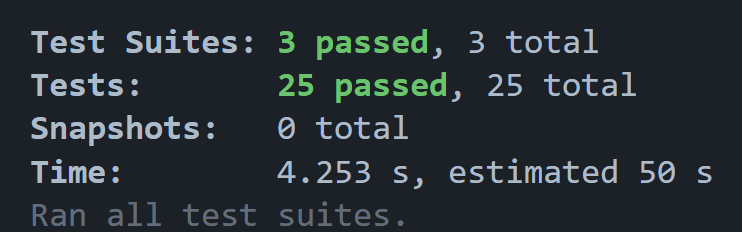

# TicketVault

A ticket booking app built to handle a lot of concurrent users trying to book the same seat at the same time, without ever creating a double-booking.

**Live demo:** https://ticketvault-app.vercel.app
**Demo login:** `user@ticketvault.com` / `user123`
**Admin:** `admin@ticketvault.com` / `admin123`

---

## What it does

You can browse events, pick a seat, hold it for 5 minutes, and then pay (the payment is simulated). The seat map updates in real time over WebSocket, so you can see other people's bookings come in while you're looking at the page.

The core engineering challenge: when 500 users hit 'reserve' on the same seat simultaneously, only one booking should actually go through. The rest should get a clean response, not a duplicate row in the database and not a 500 error.

---

## How double-booking is prevented

When the same seat is requested by many users at once, three things stack on top of each other to make sure only one booking happens:

### 1. Redis Lua atomic decrement

Inventory is decremented inside a small Lua script. Redis runs Lua atomically, so two requests can't both see "1 left" and both pass through the check.

```lua
local v = redis.call('GET', KEYS[1])
if not v then return -2 end
if tonumber(v) <= 0 then return -1 end
return redis.call('DECR', KEYS[1])
```

### 2. PostgreSQL row-level lock

Before changing the seat row, the booking transaction grabs a lock on it. The `NOWAIT` keyword makes the second request fail straight away instead of waiting in a queue:

```sql
SELECT * FROM seats WHERE id = $1 FOR UPDATE NOWAIT
```

The error handler catches the lock-failed error and returns HTTP 423 so the client sees a clean response instead of a generic 500.

### 3. Status check inside the transaction

Even with the lock acquired, the seat status is checked one more time before the booking is written. Just an extra check in case some other code path changed the seat in between.

### How it's tested

The integration test in `tests/integration/bookingFlow.test.ts` fires 50 concurrent booking requests for the same seat. Exactly one becomes a booking. The other 49 are queued or fail cleanly. This test runs on every push to GitHub.

---

## Performance

Tested with k6 against the same backend code that runs on the live demo. Postgres and Redis are running in Docker for these tests.

| Test | VUs | Successful bookings | Doubles in DB | p99 latency | Throughput |
|---|---|---|---|---|---|
| Realistic load | 100 | 50 | 0 | 155 ms | 552 req/s |
| Stress test | 500 | 50 | 0 | 890 ms | 550 req/s |

After every test, the database is checked directly for any seat with more than one active booking:

```sql
SELECT seat_id, COUNT(*) FROM bookings
WHERE status IN ('pending','confirmed')
GROUP BY seat_id HAVING COUNT(*) > 1;
```

Result every time: `(0 rows)`.

Screenshots of the k6 output and the database check are in [`docs/`](docs/).

---

## Tech stack

| Part | Tech |
|---|---|
| Backend | Node.js 20, TypeScript, Express |
| Database | PostgreSQL 16 |
| Cache and Lua scripts | Redis 7 (ioredis) |
| Real-time | Socket.IO with Redis adapter |
| Auth | JWT plus single-use refresh tokens |
| Frontend | React 18, Vite, Zustand |
| Tests | Jest (unit, integration, e2e), k6 (load) |
| CI | GitHub Actions (typecheck on every push) |
| Hosting | Render (API), Neon (Postgres), Upstash (Redis), Vercel (frontend) |

---

## Features

- Browse events with a live seat map
- Reserve a seat with a 5-minute hold and visible countdown
- `Idempotency-Key` header on the booking endpoint so client retries never create duplicate bookings
- Waitlist queue when an event is sold out, with position tracking
- Real-time seat availability updates over WebSocket
- Simulated payment with success and failure paths; a failure releases the seat back to inventory
- JWT auth with single-use refresh-token rotation (if a rotated token is reused, the client gets 401)
- Admin dashboard with bookings, revenue, audit log, and live event occupancy
- Background worker that releases stale reservations every 30 seconds

---

## Architecture

```
Browser (React + Socket.IO client)
        |
        | HTTPS / WSS
        v
Express API (Node 20)
        |
        +--> Postgres -- bookings, seats, events, audit log
        |
        +--> Redis ---- inventory counter, waitlist queue,
        |               idempotency keys, reservation TTLs
        |
        +--> Socket.IO  seat-state broadcast via Redis Pub/Sub
```

What happens when someone clicks "reserve seat":

1. Claim the idempotency key in Redis with `SET NX`. If the same key has been seen recently, the cached response is returned.
2. Decrement the inventory counter using the Lua script.
3. If the counter was already 0, push the user onto the waitlist queue and return HTTP 202.
4. Otherwise open a Postgres transaction.
5. Lock the seat row with `SELECT FOR UPDATE NOWAIT`.
6. Mark the seat reserved, insert the booking row, and write the audit log entry.
7. Set the 5-minute reservation TTL in Redis.
8. Broadcast the seat update over WebSocket so other browsers see it immediately.

---

## Run it locally

You need Node 20+, Docker Desktop, and Git.

```bash
# 1. Start Postgres and Redis
docker compose up -d postgres redis

# 2. Backend
cd backend
cp .env.example .env
npm install
npm run migrate
npm run seed
npm run dev          # runs on http://localhost:3000

# 3. Frontend (in a new terminal)
cd frontend
npm install
npm run dev          # runs on http://localhost:5173
```

The seed creates a 500-seat event and two demo accounts: `user@ticketvault.com / user123` and `admin@ticketvault.com / admin123`.

---

## Tests

```bash
cd backend

# Unit tests for the Redis Lua scripts and the idempotency primitive
npx jest --testPathPattern="tests/booking.test.ts"

# Integration tests against real Postgres and Redis (this is where the 50-concurrent proof lives)
npx jest --testPathPattern="tests/integration"

# End-to-end tests over HTTP, including the simulated payment flow
npx jest --testPathPattern="tests/e2e"
```

All 25 tests pass against a freshly migrated database.



To run the k6 load test you need the backend running on `localhost:3000`. See `scripts/load-test.js` for the test script.

---

## Project structure

```
ticketvault/
├── .github/workflows/ci.yml      Typecheck on every push
├── backend/
│   ├── src/
│   │   ├── routes/               auth, events, bookings, payments, admin
│   │   ├── services/
│   │   │   ├── booking/          Lua gate, row lock, waitlist
│   │   │   ├── payment/          Simulated pay, success/fail handling
│   │   │   ├── event/            CRUD, surge pricing, seat-map generation
│   │   │   └── websocket/        Socket.IO with Redis adapter
│   │   ├── workers/expiryWorker  Background reservation expiry
│   │   ├── middleware/           auth, rate limit, refresh-token rotation
│   │   ├── redis/                ioredis client and 5 Lua scripts
│   │   └── db/                   Schema, migration, seed
│   └── tests/                    Unit, integration, end-to-end
├── frontend/src/                 React + Vite app
├── scripts/load-test.js          k6 load test
├── docs/                         Load test results and screenshots
└── docker-compose.yml            Local Postgres + Redis
```
